# Foo Bar

## The Secret Invitation

Late one night (11.42pm on the 11th December, 2023 to be precise), I was searching on my laptop (using google chrome) for some documentation on scipy's curve_fit function and how to use a sine wave as the line of best fit (I was trying to solve a coding problem at the time related to detecting and correcting anomalous data samples over time). The exact search term was "scipy curve fit sin". 

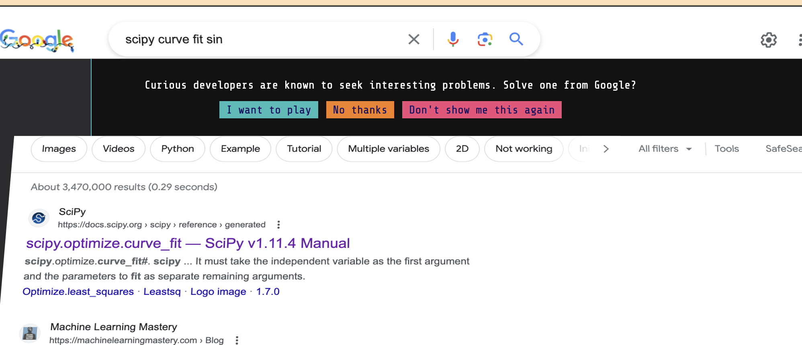

To my suprise, the search results fell back revealing a sneak peak at some kind of backdoor challenge. It asked if I wanted to play or not. My curiosity got the better of me and I paused my work to accept the challenge. As soon as I did, the screen opened up completely to reveal a secret code challenge from Google. It was quite intruiging and felt like I was a hacker who had stumbled upon the dark web or something!


There was a simple black screen like a linux terminal. So i typed in a basic command like "ls" to see if there were any files - there were! I was shocked to see a readme.txt and some other files.  It felt discovering a clue in a virtual escape room.  So i immediately typed "cat readme.txt" to open the file and read the clue! It introduced the challenges along with some backstory to go with it (something about saving bunnies).  This was so fun!  

## Level 1
I typed in the help command to see what other things i could do.  It said i could request a challenge by typing "request".  So naturally I did.  Then a new directory appeared! I cd into the new directory and read the instructions there.  It gives a typical coding challenge with two test cases that i can check my solution against.  I type "edit solution.py" and a blank python function called solution() appears for me to fill out.  I add in my code and test it out on my local terminal to ensure it gets the test cases.  Then i type "verify solution.py" and it runs it on some hidden tests too.  Success! The first challenge was completed.  I can't quite remember what the question was about now - but it was fairly simple requiring a few lines and recursion. The recursion looked something like this:

```python
    ...
    y = int(x**0.5)**2
    remainder = x - y
    do_again(y)
    ...
```
It gave me 6 days to complete but only took about 15mins or so. I "submit solution.py" and a bunny appears on screen saying I successfully completed level 1! 

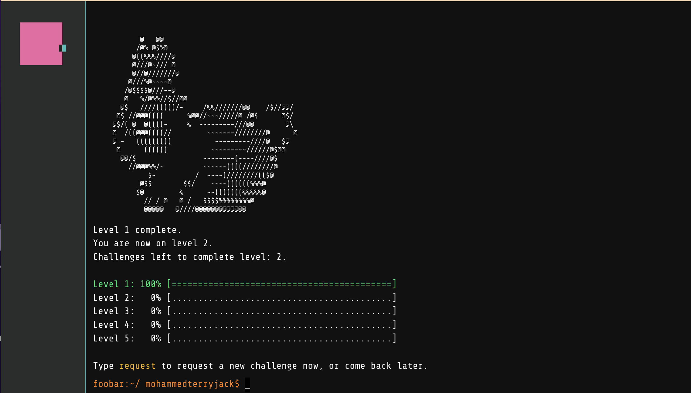


## Level 2
I requested the next challenge.  
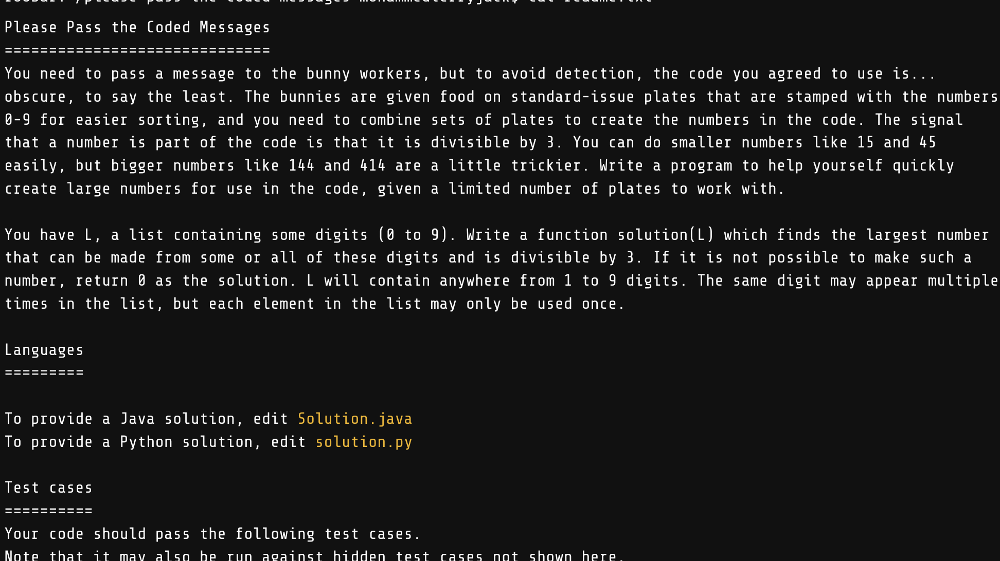

It wasn't as simple to solve this time. A depth first recursive call failed, so i figured I needed to run a breadth first. 

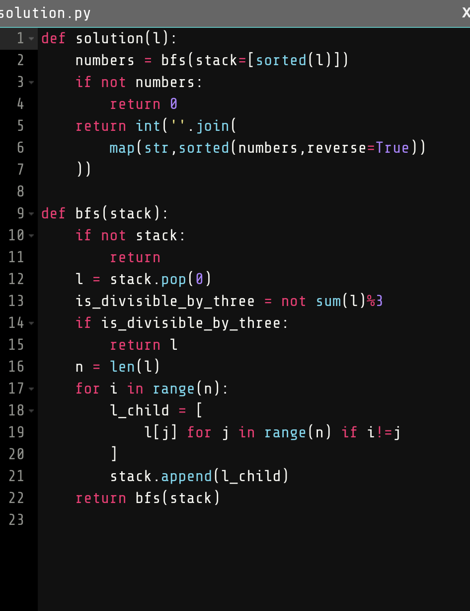

And it passed all the hidden test cases! Woohoo. Again it gave me 6 days to complete but this one only took about 40 minutes (with one failed verification)

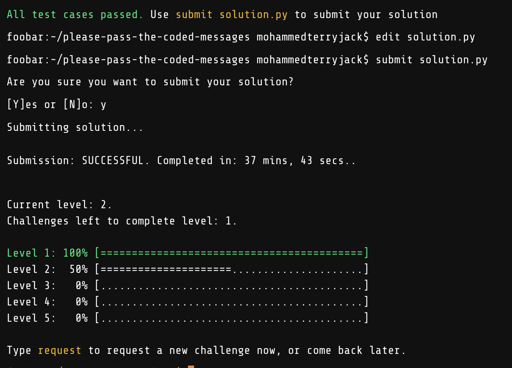

But hold on! After i submitted the solution.py this time, rather than getting another bunny congratulating me - I only saw half of the level 2 bar fill up!  I thought this meant my code was sub-optimal or the linting was not great, etc. It had only been rated as 50%!  I was slightly disheartened. But then I realised, there must be another challenge in this level.  So Level 1 had 1 challenege, but level 2 has 2!  I requested the next challenge immediately! I can't recall the question but my solution took another 40 minutes or so (shown below) and didn't require any recursion this time, but to iterate through the string optimally (i.e. only pass through each character once), I used a while loop with two pointers (as opposed to a simple for loop).

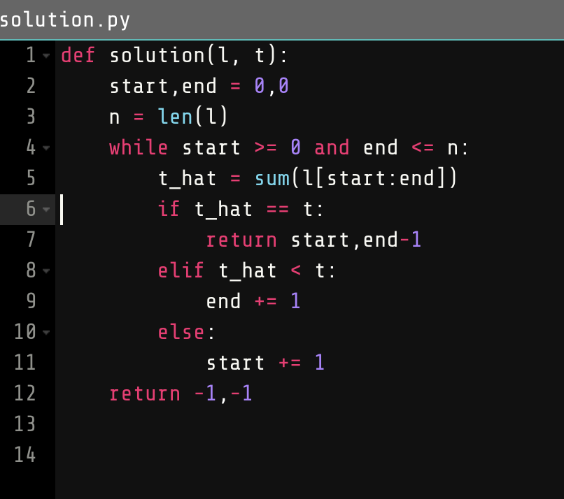

I submitted it and now the level 2 bar went green to indicate I had completed the level! As a reward I got a friend referral code! So i sent it to an old colleague in the AI world (who I had co-authored a paper with) because he had recently lost his AI company and was looking for things to do alongside his phd. (This meant he could try these challenges too without waiting to be invited).  

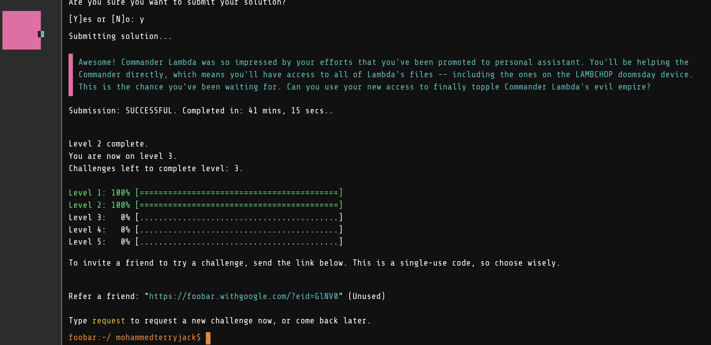

It was getting late (around 1.30 am at this point) and so I requested the next challenge as I was curious to see how much harder it could be, but decided to leave it to solve for tomorrow night (since I had 6 days to complete it anyway) - giving me something to look forward to!

## Level 3
The next night I sat down to attempt the challenge.  It was actually quite a head-scratcher this time. Then I wondered if AI could solve it.  So i copied the challenge into chat-gpt to see how its solution would do on the test cases. To my utter shock, it managed to write a code that completed the tests! 

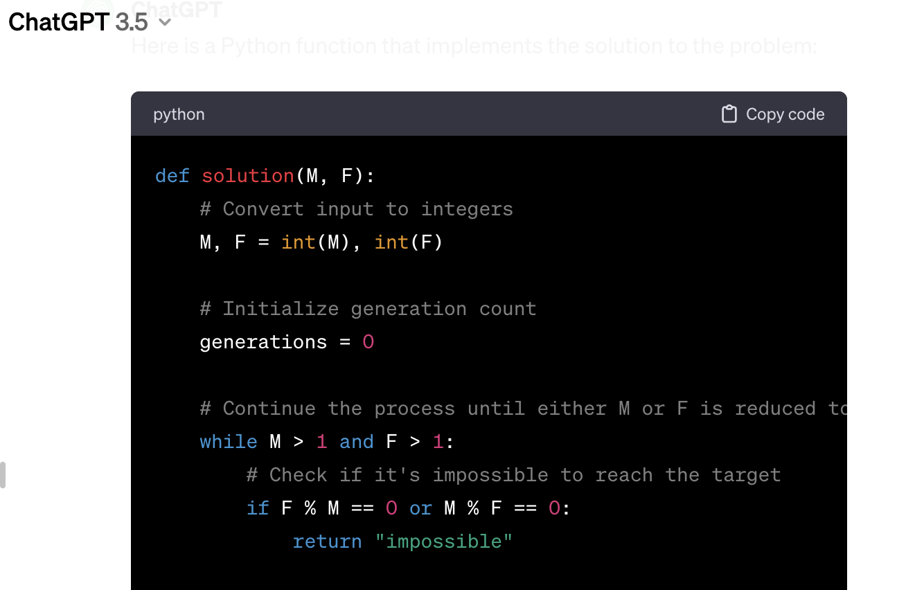
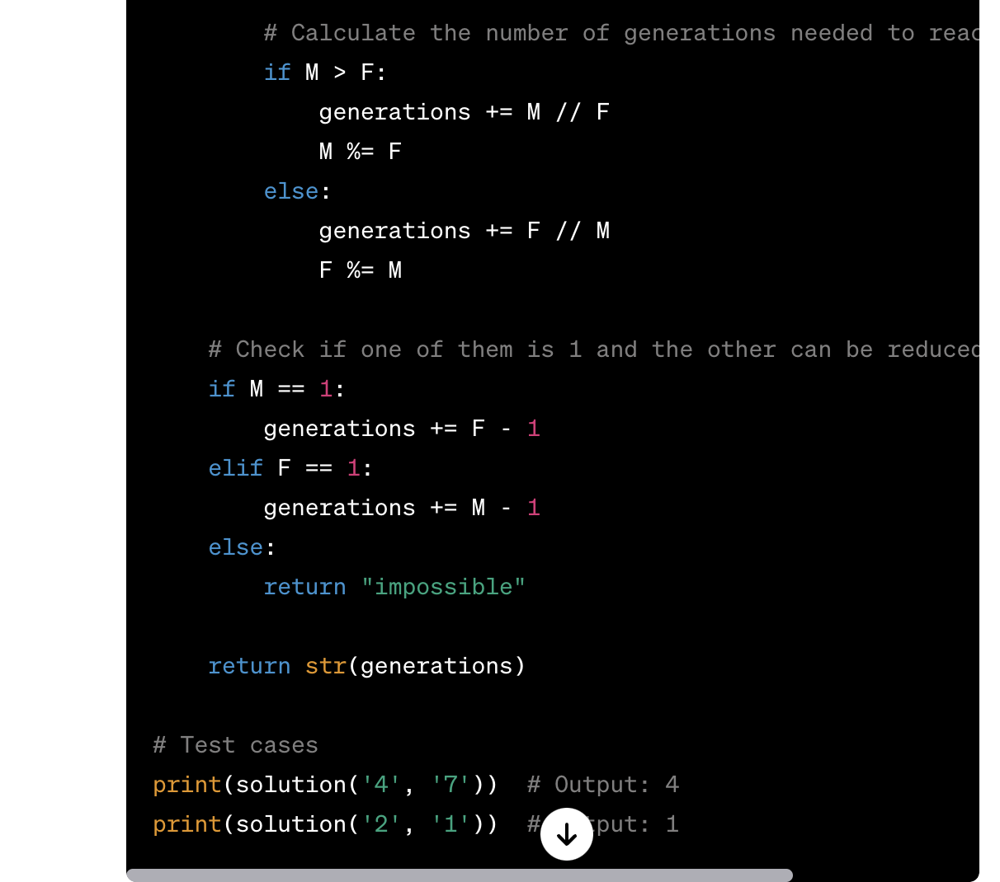

I optimised its code and used its main line of thinking to help solve this challenge.

![screenshots/Screenshot 2023-12-13 at 22.17.06.png]

The progress bar for level 3 went up to 33% which told me there were a total of 3 challenges in level 3.  One down, two to go. 

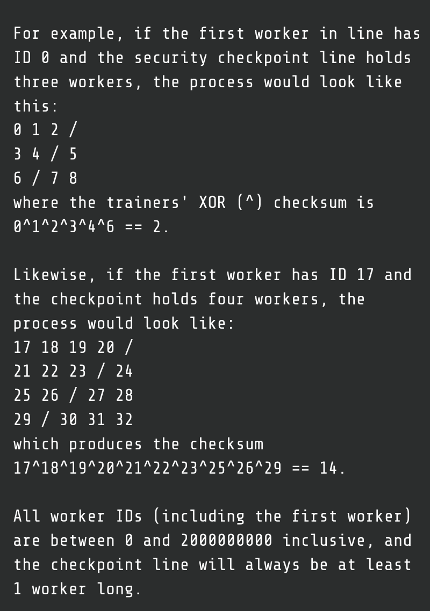
Unfortunately, it seems the chat-gpt hack was a one-hit wonder as it failed to solve any subsequent challenges I gave it after that! Its main issues were that its code/approach wasn't optimal enough to pass the hidden test cases - which are usually very large values and sub-optimal approaches would simply take too long or throw an out of memory error - or that it would just fail even the seen cases with results that were way off! So I ditched the AI and decided it had done its part.  I went back to my good ol' noggin.  This challenge was particularly interesting as it required an optimal way of computing xor.  I realised the hidden tests were failing, not because the answers were wrong, but because it was taking too long to compute. I figured this out when i hard-coded the answers to the seen test cases in the solution function and it passed (but failed if i would compute them).  So this gave me the hint I needed and i wrote a very efficient way to calculate xor. 

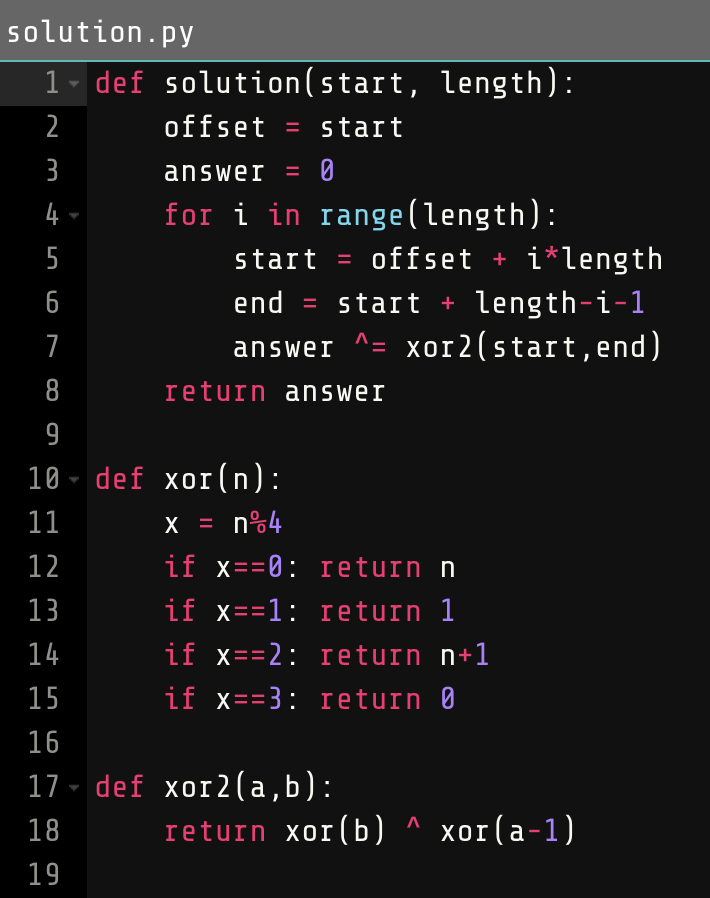

It worked and the challenge was completed in about 15 minutes.  I kept going and requested the third and final challenge of this level. But it was tough! I left it for the next night, but even then my attempts were failing.  It was only the night after that I finally figured it out!  


It took me almost 2 days but I was so happy to have submitted the solution and completed level 3. 


At this point I was given an option to be contacted by a recruiter from Google!  I wasn't sure if I should say yes, no or ask later.  I was already in a very comfortable job and when I asked my family what I should do I got mixed responses (similar to those in my head).  On the one hand, i wanted to click yes because this was Google! on the other hand I wanted to click, ask me later, because I wanted to see if i could complete all the challenges first.  But then I thought, it may not actually ask again! And from my experience, when you put things off till later, they usually never come round again.  So I decided to go with my gut and click "yes".  It asked for my email, name and linkedin.  I filled that in quickly and headed home for the night (I was visiting my mother in London and decided to submit the challenge before I drove back).

## Level 4

The next challenge was about combinations and I always love these types of questions as it gives me a change to use binary numbers (a personal favourite).  
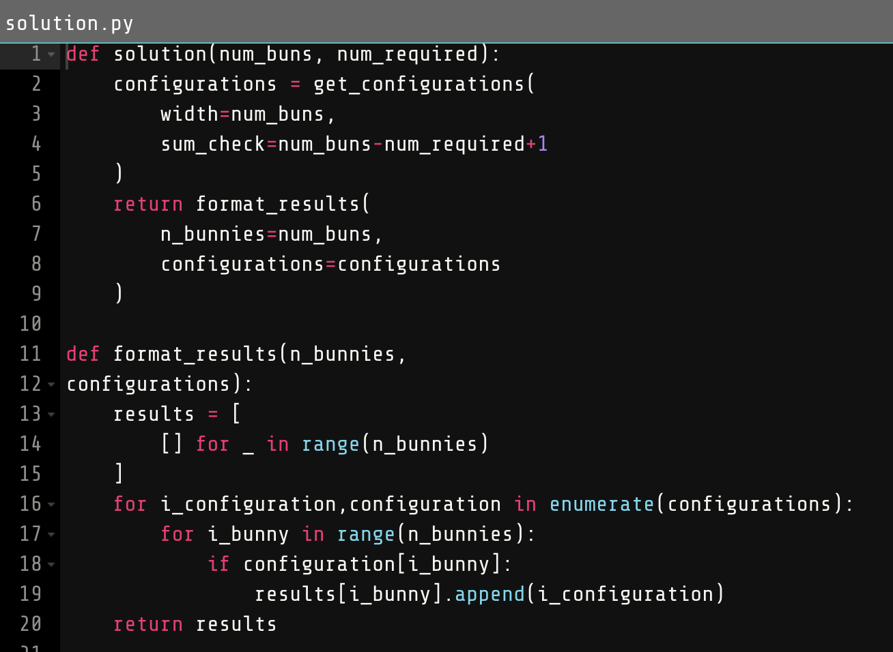
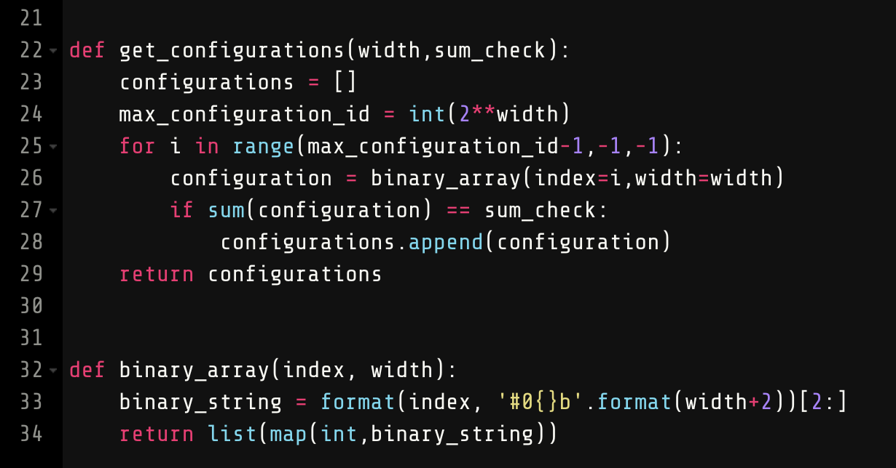

It took me about a day to solve but eventually submitted the solution at 1am and was suprised to find that the progress bar filled up to 50% this time (as opposed to 25%) which indicated level 4 only had 2 challenges!  The end was near!

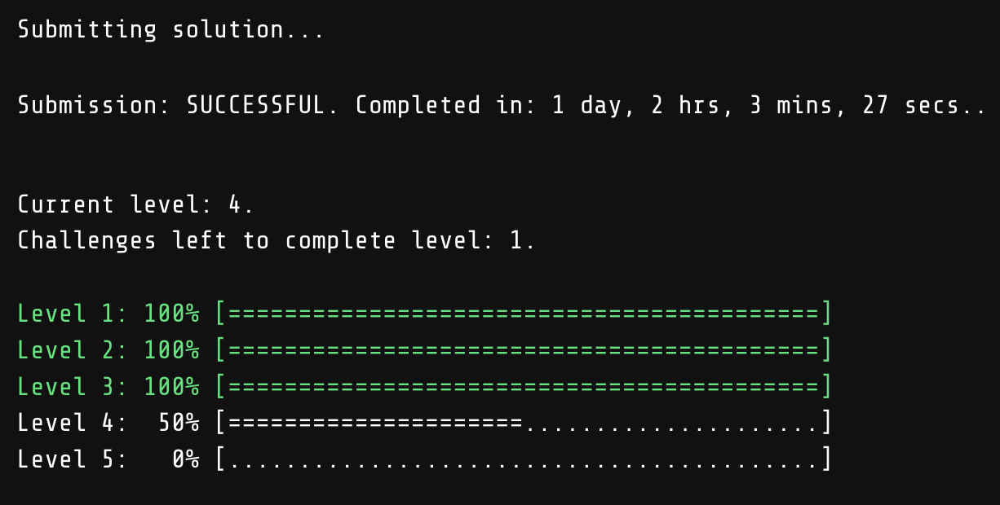

After another day or so, I completed level 4 (see solutions/challenge4.py). I was rewarded with another friend request. 


This time i decided to send this to my University friend who had studied coding and electronic engineering with me. We had passed by the google offices one day and said to each other we would work there one day.  So I thought this invite linke would be a nice throwback to those days.  

## Level 5
Two days this final challenge took.  But in the end it was such a simple solution! I first tried to use all this fancy bit manipulation to calculate squareroot efficiently. 

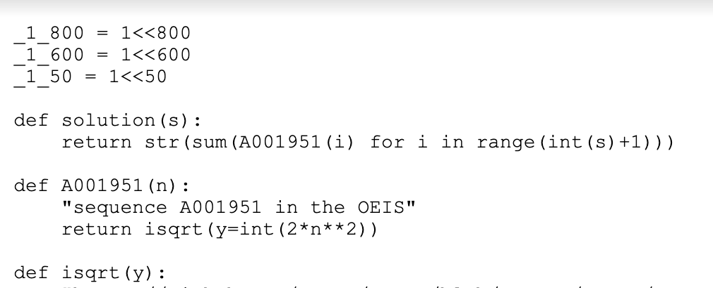

But the solution was still failing so I realised it must be the precision for larger numbers (the largest value being 10^100).  The fact that the function returned the integer as a string was also a hint toward this fact too. So I used python's Decimal class to allow for arbitrary precision and all of a sudden some hidden test cases got solved! 

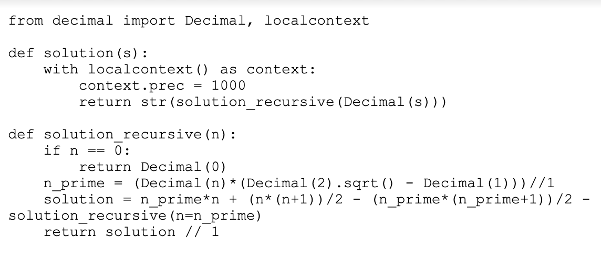

I realised i was on the right track and so increased the precision and all tests got solved! Hallelujah! Bunnies saved!
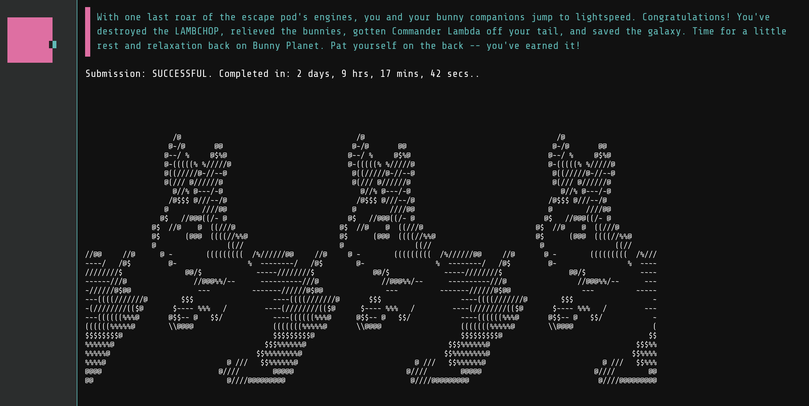


## The Win
As a final clue, I was given an encrypted string - which looked like a base64 encoded string but when decoding it there was just jibberish. So i googled how to decode the final message and realised I needed to use my username as a cypher.  The decrypted message was a dictionary which is for MY eyes only (apparently)!
